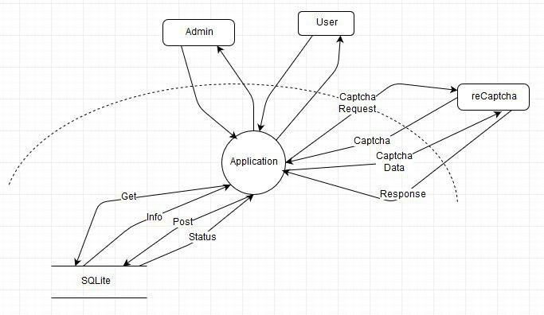

# STI - Projet 2

Auteurs: Mathieu Jee, Romain Silvestri

Date: Janvier 2019

## Table of content

## Introduction
Le but de ce projet est de sécuriser une application de messagerie. Cette application ayant été réalisée par un groupe d'étudiant, il est plus que probable qu'elle présente des failles pouvant compromettre sa sécurité. Il faut donc trouver ces failles, les documenter et appliquer un correctif. Les corretifs appliqués ne doivent en rien changer le fonctionnement du service. Celui-ci remplir le même cahier des charges que pour l'étape 1. 

## Description du système

### DFD

### Biens

Les biens que contient cette application sont: 
- les informations client. Elles se composent : du nom de l’utilisateur, du hash de son mot de passe et de la liste de ses emails.
- La clé privée reCaptcha utilisée pour envoyer les données du cpatcha au serveur pour la vérification.

### Périmètre de sécurisation

Comme on peut le voir sur le diagramme ci-dessus, l’application possède une zone sécurisée qu’il n’est pas possible d’atteindre sans se connecter. Cette zone est séparée en deux parties : la partie utilisateur qui est accessible par les utilisateurs normaux et les administrateurs et la partie administrateur qui est accessible seulement par ces derniers.

La seule page qui est accessible sans s’authentifier est celle de login. Lors d’une tentative de connexion sur une des pages protégées, une vérification est effectuée. Si jamais l’utilisateur ne s’est pas authentifié, il est automatiquement redirigé sur la page de login. 

Après avoir utilisé l’application, l’utilisateur peut se déconnecter ce qui a pour effet de supprimer les informations de session en cours et de le rediriger sur la page de login. Il ne peut plus accéder à la zone protégée tant qu’il ne s’authentifie pas à nouveau.

## Sources de menaces

Les sources de menace pour cette application sont les personnes voulant avoir accès à des informations potentiellement confidentielles sur l’entreprise en accédant aux emails de ses utilisateurs. Cette catégorie comprend majoritairement des hackers recherchant, soit à exposer des informations de l’entreprise au public, soit à monnayer les informations récupérées avec l’entreprise. Cependant, nous pouvons également très bien trouver des *script-kiddies* voulant essayer divers outils trouvés sur le web sur une application réelle sans avoir véritablement de but autre que de s’amuser, de développer ses connaissances ou pour la gloire. 

## Scénarios d'attaques

### Login

Le login de l’application est un lieu d’attaque très probable. La motivation principale étant que, si l’attaque réussi, on peut avoir accès à un compte utilisateur. De plus, en effectuant quelques recherches, l’attaquant se rend vite compte qu’il n’y a pas de politique de sécurité sur les mots de passe et que aucune protection contre le brute-force n’est mise en place sur le site. Il est donc (plutôt aisé) d’effectuer une attaque par brute force sur un compte admin (ou utilisateur) afin d’obtenir un accès privilégié à l’application. Un accès administrateur permettrait de modifier la base de données facilement et de changer les mots de passe des autres utilisateurs. L’attaquant aurait alors un contrôle total de l’application.

Cette attaque est de type : "Elevation of Privilege" et, dans un deuxième temps, "Information disclosure".

 ### Base de données

Les requêtes effectuées par l’application à la base de données étaient vulnérables. En effet, il était possible d’effectuer des injections SQL lors de celles-ci. Le but de cette attaque est d’accéder aux informations contenues dans la base de données et de potentiellement les modifier afin de la corrompre en changeant son contenu.

Cette attaque est de type : "Information disclosure" et "Tampering".

### Session

### XSS
Les entrées de l'utilisateur au niveau des emails n'étaient pas vérifiées. Il était donc possible d'envoyer un script à un autre utilisateur qui s'exécute lorsque le destinataire ouvre l'email. Une faille de ce type peut permettre à l'attaquant de voler des informations de session popre à l'utilisateur. Il pourrait aussi rendre l'utilisation du site impossible pour l'utilisateur.

Cette attaque est de type: "Tampering" et potentiellement, "Denial of Service".

## Contre-mesures

### Login

Afin d’empêcher ce type d’attaque, nous avons rajouté un captcha à remplir lors de chaque tentative de login. Cette mesure empêche l’utilisation de scripts permettant de brute-forcer le mot de passe et rend donc ce type d’attaque beaucoup plus compliqué et beaucoup plus gourmand en temps.

De plus, nous avons rajouté un nombre minimal de caractère pour le mot de passe de l’utilisateur. Il faut maintenant que le mot de passe soit composé de 8 caractères ou plus, d'un chiffre, d'une miniscule et d'une majuscule au minimum. Cette modification permet de rallonger encore le temps nécessaire pour effectuer une attaque par brute-force

L'introduction d'un captcha lors de la connexion peut être contraignant d'un point de vue utilisateur. Il serait peut-être plus judicieux, dans ce cas là, de demander la validation d'un captcha après 2 ou 3 tentatives de connexion échouée. Ainsi, l'utilisateur n'aura pas besoin d'utiliser de captcha lorsqu'il se connecte, ni même s'il fait une erreur dans l'introduction de son mot de passe. De plus, cette solution reste robuste face à une attaque de type brute-force.

Une autre solution aurait été de stocker le nombre d'essais de connexion effectuée par un utilisateur ainsi que le timestamp du premier essai. Si jamais le nombre d'essai sur une période de temps choisi est trop grand, on bloque l'adresse IP de l'utilisateur pendant un moment. Cette solution permet d'éviter de déranger l'utilisateur en lui demandant de remplir un captcha à chaque tentative de connexion.

### Base de données

Afin de se protéger contre ce type d’attaque, nous avons changé les requêtes effectuées à la base de données par des "prepared statement" afin de prévenir tout risque d’injections SQL. 

### Session

### XSS
Afin de corriger ce problème, nous avons utilisé des fonctions permettant de transformer les données rentrées par l'utilisateur en texte inoffensif. Nous avons appliqué ces fonctions sur le sujet et le contenu des emails envoyés afin d'empêcher toute attaque de ce type.

## Protections supplémentaires

### HTTP Headers

Le protocole *HTTP* propose, de base, quelques *headers* directement lié à la sécurité. Il serait dommage de ne pas les utiliser. 

*(Certains des éléments qui vont suivre concerne le protocole HTTPS. Bien que le cadre de ce projet se limite au protocole HTTP, nous parlerons quand même de certaines pratiques de sécurité liées à HTTPS)*

- **Strict-Transport-Security (HSTS):** Ce *header* force le *browser* à effectuer les requêtes vers notre domaine avec *HTTPS*. En communiquant uniquement en *HTTPS* avec le serveur, un attaquant se trouvant sur le même réseau que la victime ne pourra pas déchiffrer les données qu'il sniffe.

  Ce *header* doit être activé depuis les fichiers de configuration du serveur.

- **X-XSS-Protection:** *header* qui stope tout chargement de pages détectées comme *reflected cross-site scripting (XSS)*. Ce *header* protège seulement de certains type de *XSS*. 

- **Content Security Policy (CSP):** Permet de se protéger contre certaine exécution de code malicieux. En créant une politique *CSP*, nous pouvons dicter au *browser* ce qu'il aura le droit de télécharger et d'afficher. 

- **X-Frame-Options:** protection contre les attaques *clickjacking*. Indique au *browser* s'il a le droit ou non d'afficher le contenu compris dans les balises `<frame>`, `<iframe>`, `<embed>` et`<object>`. Bien que dans ce projet, aucune de ces balises n'est présentes, c'est une bonne pratique d'activer ce *header*. 

### Error Reporting
Afin de donner le moins d'informations possible sur le code source, ajouter `error_reporting(0);` au début de chaque fichier permet de ne rien afficher en cas d'erreur.

### Cookie

- **HTTPOnly flag**: lorsque ce *flag* est inclus dans les *headers* de la réponse *HTTP*, le cookie ne peut pas être accédé à l'aide d'un script provenant du client. Ainsi, même si le client est victime d'une attaque *XSS*, l'attaquant ne pourra pas récupérer son cookie.

## Conclusion

